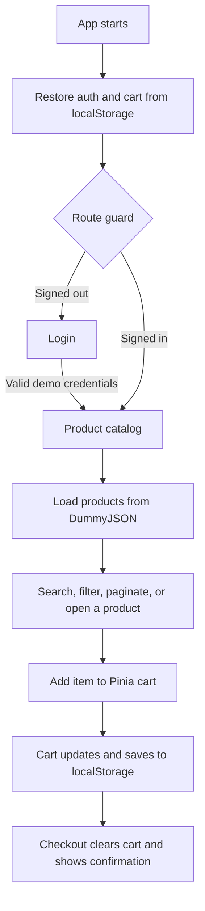

# Mini E-Commerce App Flow

The app follows this path:

## Startup and routing

`main.ts` installs Vue, Pinia, and PrimeVue, then starts the app. The router sends `/` to the catalog. Product and cart pages require sign-in; the route guard redirects signed-out visitors to login and remembers the page they were trying to reach.

See `src/main.ts`, `src/router/index.ts`, and `src/router/guards/auth.ts`.

## Login

`LoginPage` passes the entered credentials to the auth store. This is a demo login, not server authentication: `authStorage` accepts `admin` or `admin@example.com` with password `admin123`, then saves a mock token and user profile in `localStorage`. After login, the app returns to the requested page or opens the catalog.

See `src/pages/LoginPage.vue`, `src/stores/useAuthStore.ts`, and `src/services/authStorage.ts`.

## Pinia stores and Axios interceptor

The app uses two Pinia stores:

- `useAuthStore` keeps the current user, token, and login loading state. Its computed values expose whether the user is authenticated or an admin. The router guard and app layout use this store.
- `useCartStore` keeps cart items, computes the item count and total price, and provides actions to add, remove, or change quantities. It persists cart changes in `localStorage`.

There is also a basic `useCounterStore` in `src/stores/counter.ts`, but no app page or layout uses it.

The Axios instance in `src/services/api.ts` has a request interceptor. Before a request, it reads the token from `localStorage` and adds it to the `Authorization` header as a Bearer token when one exists. There is no response interceptor for handling errors, retries, or transforming responses. The login flow creates a mock token locally.

See `src/stores/useAuthStore.ts`, `src/stores/useCartStore.ts`, `src/stores/counter.ts`, and `src/services/api.ts`.

## Catalog and product details

The catalog composable requests products and categories from DummyJSON. Search waits briefly before requesting results; category selection and pagination trigger catalog reloads. Selecting a product opens its detail page, which fetches that product by ID.

See `src/composables/useProductCatalog.ts`, `src/services/product.service.ts`, `src/pages/ProductListPage.vue`, and `src/pages/ProductDetailPage.vue`.

## Cart and checkout

Product cards and the detail page both add items to the shared Pinia cart. The cart store tracks quantities and totals, prevents quantities from exceeding stock, and saves changes to `localStorage`. The cart page lets users change quantities or remove items. Checkout currently clears the cart and displays a success message; it does not submit an order to a backend.

See `src/stores/useCartStore.ts`, `src/components/Feature/Cart/CartLine.vue`, and `src/pages/CartPage.vue`.
